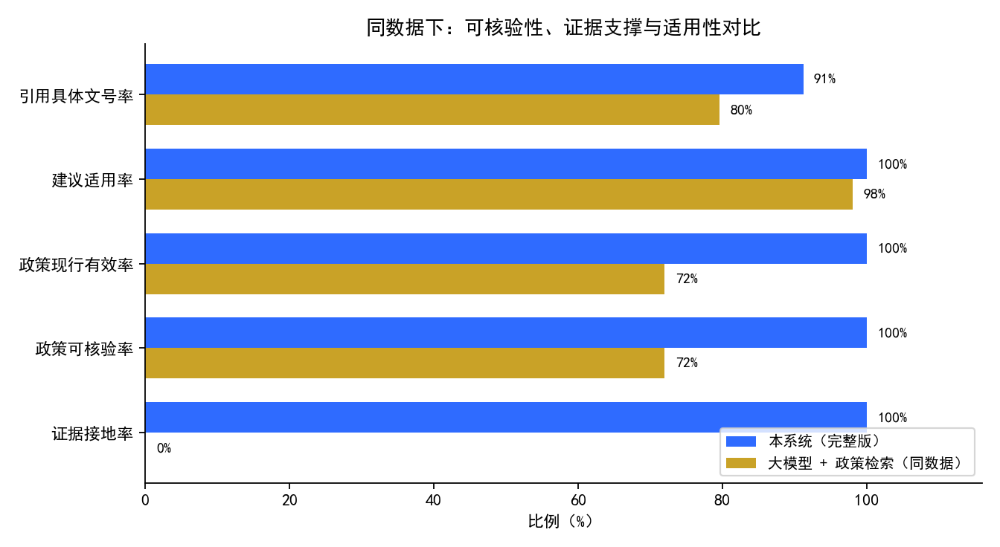
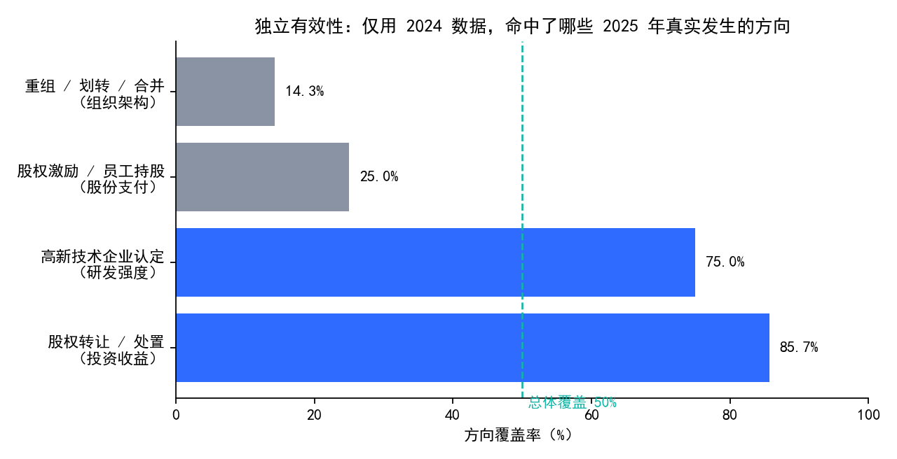

# 智能税务筹划系统 · 效果评估报告

**—— 系统给出的税务建议是否"站得住"？**

| 文档信息 | |
|---|---|
| 项目名称 | 智能税务筹划系统（可追溯证据链 + 多代理） |
| 参赛赛道 | 2026 北京市大学生数智会计创新应用竞赛 · 方向二 智能财务（税务筹划 / 涉税合规） |
| 文档性质 | 独立交付物（效果评估） |
| 版本 | v3.2 |
| 数据来源 | 巨潮资讯网公开公告；本项目 2020–2024 年结构化财务数据 |
| 评估成本 | 全部基于既有运行缓存，**未新增任何大模型调用** |

---

## 目录

1. [评估目标](#1-评估目标)
2. [评估设计](#2-评估设计)
3. [结果一：与基线对比](#3-结果一与基线对比)
4. [结果二：独立有效性验证](#4-结果二独立有效性验证)
5. [结论](#5-结论)
6. [局限与边界](#6-局限与边界)
7. [附录](#7-附录)

---

## 1. 评估目标

本报告回答两个问题：

| 编号 | 问题 | 对应章节 |
|---|---|---|
| Q1 | 在**同一份企业数据**下，本系统的建议与"大模型 + 政策检索"相比，**谁更站得住**？ | §3 |
| Q2 | 本系统**仅凭 2024 年数据**，能否发现公司**在 2025 年真实发生**的涉税方向？ | §4 |

**为什么这样定义"效果"**：在税务场景中，"准"不仅意味着方向对，更意味着建议**可核验、有依据、不越界**。因此本评估不数"猜中多少方向"，而检验建议**在政策、证据、适用性三个层面是否成立**。

---

## 2. 评估设计

### 2.1 时间口径

| 项 | 设定 | 说明 |
|---|---|---|
| 预测输入 | **FY2024**（年报） | 声明假设年报于 2025-04-30 前披露 |
| 事件窗口 | **2025-05-01 ~ 2025-12-31** | 严格晚于输入披露日，消除时间倒置 |

### 2.2 样本构成

| 组别 | 家数 | 构成 |
|---|---|---|
| **真阳组** | 30 | 首次高新技术企业认定 8、股权激励/员工持股 8、重组/划转/合并 7、股权转让/处置 7 |
| **对照组** | 59 | 同行业 + 营收规模相近，且 2025 年无该类事件 |

事件均来自**巨潮资讯网**公开公告，逐条附出处链接。

### 2.3 对比对象

| 对象 | 企业数据 | 政策检索 | 证据链 / 确定性计算 | 说明 |
|---|:---:|:---:|:---:|---|
| **本系统（完整版）** | ✓ | ✓ | ✓ | 主评估对象 |
| **大模型 + 政策检索** | ✓ | ✓ | ✗ | **主对比基线**（与本系统使用相同检索能力） |
| 纯大模型直答 | ✓ | ✗ | ✗ | 参考（见附录 A） |

**公平性保证**：所有系统获得**同一份企业数据摘要**（约 20 个原始报表科目），**仅给原始金额，不给任何方向提示**（不含"研发强度高"等加工结论，也不含 `is_hightech` 等标签）；输出统一为 `方向 + 政策依据 + 置信度 + 理由`，最多 5 条。

### 2.4 指标定义

| 指标 | 定义 | 计算方式 |
|---|---|---|
| **证据接地率** | 建议是否有**直接企业事实**支撑 | 结论引用的企业字段中，分辨率（resolution）为 DIRECT 的比例 |
| **政策可核验率** | 引用政策能否在**官方政策库**中定位到具体文件 | 在 5,593 条官方政策语料中按文号/标题匹配的比例 |
| **政策现行有效率** | 引用政策相对 2024-12-31 是否现行有效 | 依据政策时效判定（VALID / EXPIRED / 未生效 / 未知） |
| **建议适用率** | 建议方向的**前置条件**是否被公司数据满足 | 前置条件由 Skill 定义**自动推导**（见下），不手写、不人工判断 |
| **引用具体文号率** | 是否给出可定位的具体文号 | 政策引用是否包含文号（如"财税〔2018〕54号"） |

> **前置条件的自动推导**：读取每个 Skill 的 `required_facts`，剔除通用字段（名义税率、营业收入等），得到"方向特异字段"（研发筹划 → 研发费用；政府补助 → 政府补助；高新技术企业 → 是否高企；……）。只要其中任一字段在 2024 数据中存在且为正，即视为"适用"。

---

## 3. 结果一：与基线对比

**主对比基线：大模型 + 政策检索（同数据）**



| 指标 | **本系统（完整版）** | 大模型 + 政策检索 | 差值 |
|---|---:|---:|---:|
| **证据接地率** | **100.0%** | **0.0%** | **+100.0 pp** |
| 政策可核验率 | **100.0%** | 72.0% | +28.0 pp |
| 政策现行有效率 | **100.0%** | 72.0% | +28.0 pp |
| 建议适用率 | **100.0%** | 98.1% | +1.9 pp |
| 引用具体文号率 | **91.2%** | 79.6% | +11.6 pp |

### 3.1 结论与解读

1. **证据支撑是最本质的差别**：本系统的每一条建议都**扎在公司自身数据上**（证据接地率 100%）；基线建议**无任何证据链**（0%），因此即便表述合理，也**无从核验**。
2. **政策可靠性**：本系统引用的政策**全部可核验、全部现行有效**；基线约 **28% 的政策引用无法在官方库中定位**，个别为编造文号（例：`国家税务总局公告2025年第X号`）。
3. **适用性**：即便在"建议是否适用"这一最宽松的公平指标上，本系统仍更高（100.0% vs 98.1%）。
4. **大模型层未损害合规边界**：本系统"确定性规则版"与"完整版"在上述各项上**完全一致**——大模型仅负责**发现与解释**，政策、证据与结论始终由确定性规则与证据门禁把关。

---

## 4. 结果二：独立有效性验证

> 本节**不与任何基线对比**，仅回答：**系统能否只凭历史数据，发现后来真实发生的方向？**

### 4.1 真实事件方向覆盖

**系统仅用 2024 年数据**，对照 2025 年真实公开事件：



| 2025 真实事件（对应方向） | 覆盖率 | 命中/总数 |
|---|---:|---:|
| 股权转让 / 处置（投资收益） | **85.7%** | 6 / 7 |
| 高新技术企业认定（研发强度） | **75.0%** | 6 / 8 |
| 股权激励 / 员工持股（股份支付） | 25.0% | 2 / 8 |
| 重组 / 划转 / 合并（组织架构） | 14.3% | 1 / 7 |
| **总体** | **50.0%** | **15 / 30** |

**解读**：覆盖率取决于该方向**能否由财报推断**。
- 可由财报推断的方向（投资收益 → 投资收益科目；高新技术企业 → 研发强度）→ **覆盖高**；
- 纯事件驱动的方向（股份支付、组织架构）→ 财报无法体现 → **覆盖低**。

系统不是"猜事件"，而是"**从数据里发现方向**"。

### 4.2 深度个案（示例）

系统仅用 2024 数据，以下为可复核案例（完整 10 例见 `validation/eval/deep_cases.md`）：

| 公司 | 系统在 2024 数据下的判定 | 2025 真实事件 | 出处 |
|---|---|---|---|
| 新泉股份（603179） | 高新技术企业 → 有条件推荐，依据 国家税务总局公告 2017 年第 24 号 | 2025-11-25 全资子公司通过高新技术企业认定 | [链接](https://static.cninfo.com.cn/finalpage/2025-11-26/1224824420.PDF) |
| 桂林旅游（000978） | 投资收益 → 纳入视野 | 2025-12-26 完成资江丹霞公司 100% 股权暨债权转让 | [链接](https://static.cninfo.com.cn/finalpage/2025-12-27/1224901234.PDF) |

### 4.3 回归测试集覆盖度

| 套件 | 用例数 | 覆盖 | 通过率 |
|---|---:|---|---:|
| Skill 两层测试（Calculator + Decision） | 147 | 21 Skill / 21 Calculator | 100% |
| Golden Cases（业务语义） | 5 | 5 类核心语义 | 100% |
| 模块测试 | 23 | 结论四态 / 计算器边界 / 证据层 | 100% |
| **合计** | **175** | — | **100%** |

---

## 5. 结论

| 问题 | 结论 |
|---|---|
| **Q1 对比** | 在同一份数据下，本系统的建议在**证据接地（100% vs 0%）、政策可核验（100% vs 72%）、政策现行有效（100% vs 72%）、建议适用率（100% vs 98.1%）**上全面领先；且引入大模型**未损害**任何一项合规边界。 |
| **Q2 有效性** | 系统**仅凭 2024 数据**，命中了 2025 年 **50%（15/30）**的真实事件方向；其中**可由财报推断的方向达 75–86%**。 |

**核心价值定位**：本系统的差异化优势不在于"猜得更准"，而在于**每一条建议都可核验、有证据链、受政策时效约束**——这是**结构性保证**。

---

## 6. 局限与边界

**我们主张**：
- 在同一份数据、同一种输出要求下，本系统建议**100% 有直接企业事实支撑**、**100% 引用现行有效的可核验政策**；
- 系统**仅凭历史数据**即可发现约一半后来真实发生的方向（数据可推断方向达 75–86%）。

**我们不主张**：
- "政策可核验率 100%"**不等于**"建议正确率 100%"——该指标由系统架构保证（政策来自自有库、时效门禁、方案由事实构造）；
- "政策不可核验"**不等于**"编造"——政策库为官方文件的子集；
- 本评估**不预测**未来事件，也**不是**对企业总体税务筹划需求的无偏估计。

**局限**：
1. 样本为 30 家真阳 + 59 家对照，**规模有限**，比例仅作参考；
2. "建议适用率"仅判断方向前置条件是否成立，**不判断方向是否最优**；
3. "证据接地"仅证明存在直接事实，**不等价于**已满足全部政策条件。

---

## 7. 附录

### 附录 A：纯大模型直答（参考）——文号率略高的原因

| 系统 | 建议适用率 | 引用具体文号率 | 证据接地率 |
|---|---:|---:|---:|
| 纯大模型直答（给数据） | 98.3% | **94.3%** | 0% |
| **本系统（完整版）** | **100%** | 91.2% | **100%** |

纯大模型直答的"引用具体文号率"为 94.3%，**略高于本系统**。原因是它**反复引用同一小撮知名政策**：

| 引用次数 | 政策 |
|---:|---|
| 80 | 财政部 税务总局公告 2023 年第 7 号（研发加计） |
| 77 | 财税〔2011〕70 号（不征税收入） |
| 71 | 国科发火〔2016〕32 号（高新技术企业认定） |
| 59 | 财税〔2018〕54 号（设备器具一次性扣除） |

它对**几乎所有公司**给出**几乎同一套**政策——**形式具体、实质通用**。因此"引用具体文号率"衡量的是"**是否写得出文号**"，而非"**是否与这家公司相关**"。真正与公司相关的判断见正文**证据接地率（0% vs 100%）**。

### 附录 B：复现方式

```bash
python scripts/eval_v3.py --stage metrics         # 政策可核验 / 现行有效 / 证据接地
python scripts/eval_v3_applicability.py           # 建议适用率（零 LLM 成本）
python scripts/make_eval_figures.py               # 生成报告配图
```

### 附录 C：数据与产物

| 产物 | 路径 |
|---|---|
| 逐条建议明细 | `validation/eval_v3/advice_all.csv` |
| 指标汇总 | `validation/eval_v3/summary.csv` |
| 建议适用率 | `validation/eval_v3/applicability.csv` |
| 覆盖明细 | `validation/eval/per_sample_B2.csv` |
| 深度个案（10 例） | `validation/eval/deep_cases.md` |
| 官方政策语料 | `knowledge/policy_corpus/policy_corpus.parquet`（5,593 条） |
| 真阳/对照样本 | `validation/ground_truth_2025.csv`、`validation/control_group_2025.csv` |
